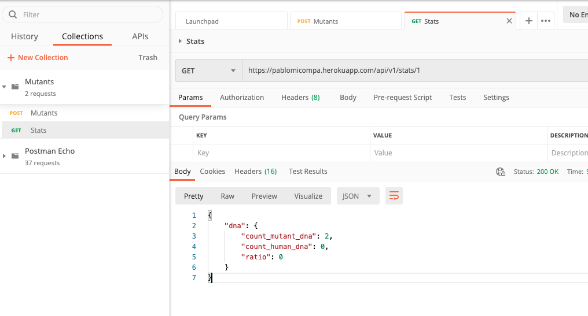
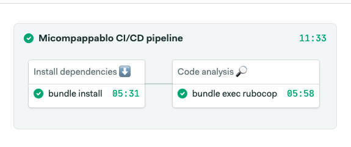

# Micompapablo API
This is a REST API to detect the mutant with its DNA
## Requirements
This API is building on Ruby 2.5.7, first you have to sure that you have that version in your environment, if you do not know how to install Ruby, I recomended to do with rben, for this following the next instructions:

[Download and install ruby with Rbenv](https://github.com/rbenv/rbenv)

## Before to start
This project has a Makefile to simplify to use of some commands if you want to see the list only to exec this:
```bash
$ make help

db-create                      Create the data base for development.
db-migrate                     Run data base migrations for development.
redis                          Run redis.
rubocop-fix                    Run rubocop with auto-fix.
rubocop                        Run rubocop.
setup                          Install dependencies from Gemfile.
sidekiq                        Run sidekiq.
start                          Start application.
test                           Run test.
```
## Documentation
In this link you can get the postman the documentation: 
[Documentación en Postman](https://documenter.getpostman.com/view/2220937/UVksKDdE)

## Instalation
After to install Ruby 2.5.7 to exec the next command to install the project in your local environment:
```bash
$ make setup
```
## User guide
To test the project in your local environment only you have to exec the next command:
```bash
$ make start
```
## CI/CD
The pipeline of Continuous integration and Continuous delivery (CI/CD) runs in SemaphoreCI. The pipeline of CI contemplates 2 parts:
<ol>
<li>Install dependencies</li>
<li>Code analysis</li>
</ol>



## Tests
The testing is with [Rspec](https://rspec.info/), if you want to exec the test suite, only you have to exec the next command:
```bash
$ make test
```
## Linter
To save the good practics, style guides and avoid code smell, this project uses `Rubocop`, only you nedd to exec the next command:
```bash
$ make rubocop
```
## Live Demo
Micompapablo is hosted in Heroku in this route:
```bash
https://pablomicompa.herokuapp.com/
```
Into the postman documentation you can find the route to call the services.
